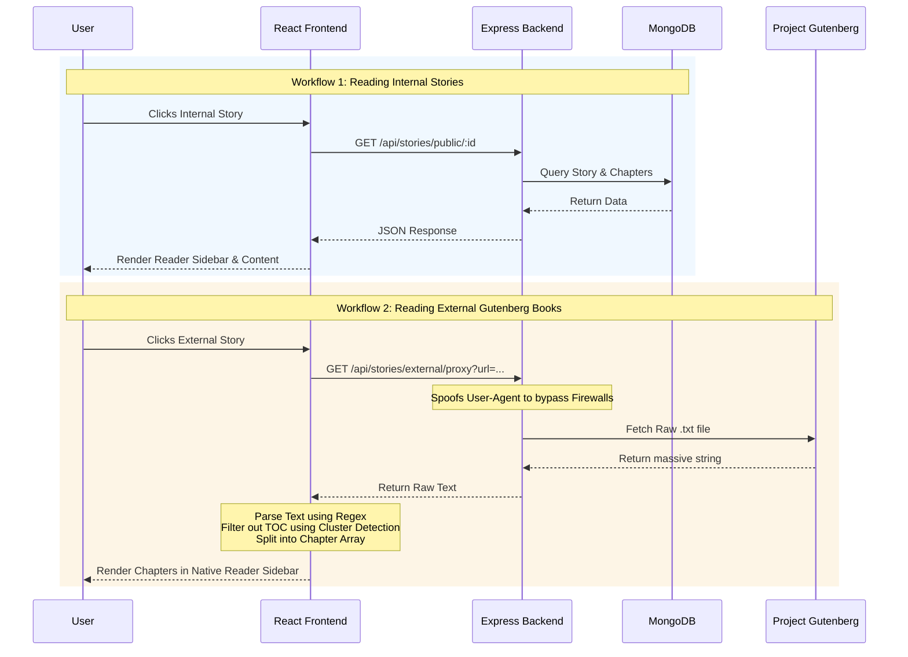

# 🚀 StoryBuilder

A full-stack web application that enables users to create, explore, and read stories. The platform focuses on structured storytelling with chapters, alternate story branches, and a seamless reading experience that seamlessly integrates external public domain books from Project Gutenberg.

## 🚀 Features

*   **Interactive Reader Interface**: A highly optimized reader that features sidebar chapter navigation, auto-scroll positioning, and a clean, distraction-free layout.
*   **External Story Integration (Project Gutenberg)**: Fetches and parses massive raw text files from Project Gutenberg on-the-fly. Uses advanced regex and cluster-detection algorithms to automatically remove Table of Contents (TOC) blocks and split the text into navigable chapters.
*   **Backend Proxy Engine**: Safely bypasses strict anti-bot firewalls (like Cloudflare) by spoofing standard browser `User-Agent` headers in the Node.js backend.
*   **Chapter & Branch-Based Structure**: Internal stories are organized into modular chapters with support for alternate narrative branches.
*   **PDF Export**: Users can export their published stories to beautifully formatted PDFs directly from the backend.
*   **Secure Authentication**: JWT-based user authentication, route protection, and session management.

## 🏛 Architecture & Workflow

The application follows a modern MERN stack architecture (MongoDB, Express, React, Node). 

Below is the architectural workflow diagram illustrating how the frontend, backend, database, and external APIs interact—especially highlighting the complex external proxy parsing workflow.



## 🛠 Tech Stack

*   **Frontend**: React.js (Vite), Tailwind CSS, React Router, Axios, Lucide Icons.
*   **Backend**: Node.js, Express.js, JSON Web Tokens (JWT), Mongoose, Undici (Fetch).
*   **Database**: MongoDB
*   **External APIs**: Project Gutenberg (Public Domain Books)

## 📂 Project Structure

```text
Story-Builder/
│
├── frontend/          # React frontend (Vite)
│   ├── src/
│   │   ├── api/       # Axios API integration
│   │   ├── components/# Reusable UI components (Navbar, Sidebar)
│   │   ├── pages/     # Page views (Main, Reader, Login)
│   │   └── utils/     # Utilities (gutenbergParser.js)
│
├── backend/           # Node.js + Express backend
│   ├── src/
│   │   ├── controllers/ # Business logic & Proxy handling
│   │   ├── models/      # MongoDB schemas
│   │   └── routes/      # API endpoints
│
└── README.md
```

## ⚙️ Setup & Installation

### 1. Clone the repository
```bash
git clone <repository-url>
cd Story-Builder
```

### 2. Backend Setup
Navigate to the backend directory and install dependencies:
```bash
cd backend
npm install
```
Create a `.env` file in the `backend/` directory with the following variables:
```env
PORT=5000
MONGODB_URI=your_mongodb_connection_string
JWT_SECRET=your_jwt_secret
```
Start the backend development server:
```bash
npm run dev
```

### 3. Frontend Setup
Open a new terminal, navigate to the frontend directory, and install dependencies:
```bash
cd frontend
npm install
```
Start the Vite development server:
```bash
npm run dev
```

The application will now be running at `http://localhost:5173`.
